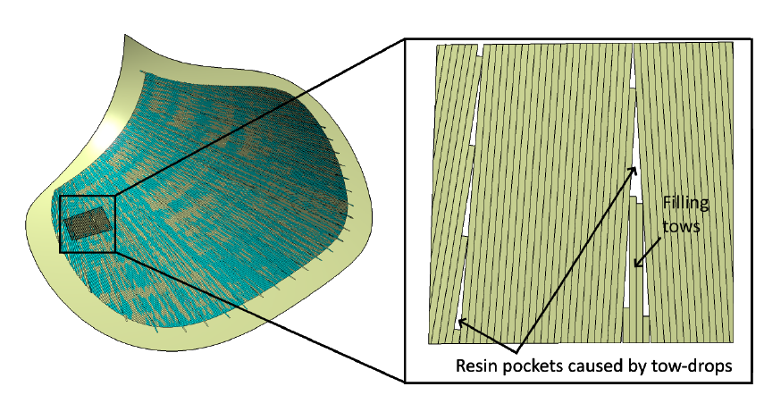
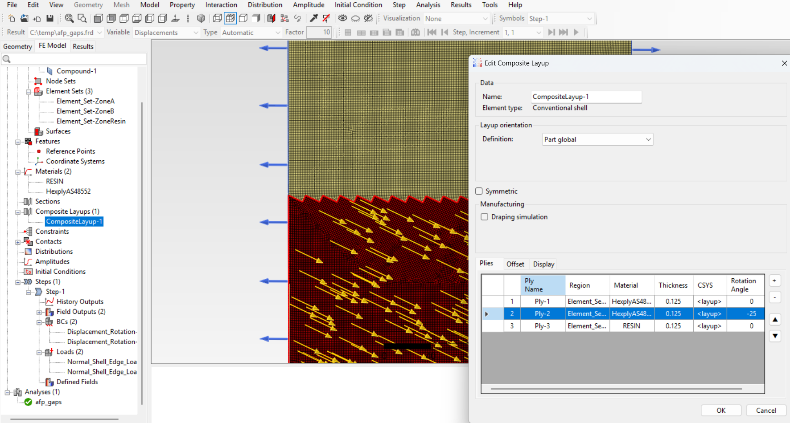

# AFP Tow-Gap Defects — FEA Impact Study

## Context

Automated Fiber Placement (AFP) produces high-quality composite laminates but introduces characteristic manufacturing defects: **tow-drops** create resin-rich pockets (gaps) between adjacent tows whenever the fiber-steering path changes orientation.

These resin pockets locally degrade stiffness and alter stress paths. Quantifying their structural impact is the goal of this study.

**Reference:** Félix Thébault, Alexandre Clément, Sylvain Fréour, Gwénolé Le Moal, Pascal Casari. *Tow-drop areas influence on composite laminates in Automated Fiber Placement.* 21st European Conference on Composite Materials, Jul 2024, Nantes, France. pp.702. [⟨10.60691/yj56-np80⟩](https://doi.org/10.60691/yj56-np80) ⟨hal-04656841⟩

---

## Approach

The article models a flat laminate panel with a single tow-drop zone, using Simulia Abaqus CAE commercial software. 
The panel is split into two regions separated by a triangulated resin-zone boundary:

- **Zone 1** — nominal ply orientation (0°)
- **Zone 2** — steered ply, offset by angle Δα
- **Resin zones** — triangular pockets filling the gap between the two zones

The plate is loaded in uniaxial tension (top/bottom) and simply supported. The fiber-angle offset Δα is swept from 0° to 40° to map sensitivity.

**Key finding from the paper:** σ₁₁max in the resin zone is significantly higher than in the healthy laminate, and grows non-linearly with Δα.

---

## Our Implementation

We reproduce this parametric study using **open-source tools only**:

| Tool | Role |
|---|---|
| **PrePoMax Composites** | Pre/post-processor — composite layup definition, ply region meshing, result visualization |
| **CalculiX** | FE solver — shell elements with composite section, linear static analysis |

The resin pockets are meshed as a distinct element set assigned an isotropic resin material, while the surrounding laminate zones use shell composite sections defined through PrePoMax's fiber modeler.

---

## FE Model

## FEA Results (Δα = 25°, example)

**Fiber-direction stress S11** — stress concentration visible at the resin pocket tip, max 20.24 MPa:

**Out-of-plane displacement U1** — small bending induced by the zone asymmetry, max 0.10 mm:

---

## Next steps

- Validate CalculiX results against the published paper's
- Extend to curved AFP paths (geodesic steering) and realistic part geometry
- Assess failure onset using Tsai-Wu or Hashin criteria on the resin pocket boundary

---

Link : https://gitlab.com/yvanblanchard/pre-po-max-composites
